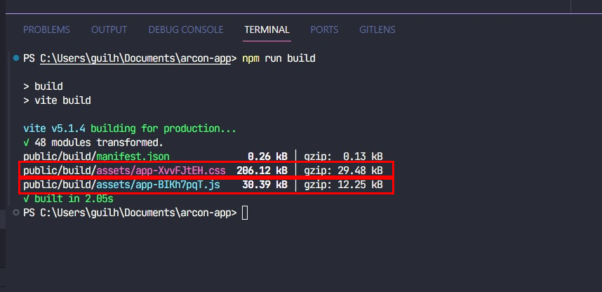

## Sobre o Aplicativo Web Arconnet

Arconnet is a web application framework with expressive, elegant syntax. We believe development must be an enjoyable and creative experience to be truly fulfilling:

## Tecnologias para Desenvolvimento

O Projeto foi desenvolvido com o framework [Laravel V10.10](https://laravel.com/docs/10.x/readme), para estilização esta sendo usado o [Bootstrap v5](https://getbootstrap.com/) e CSS, e esta sendo usado javascript para interação com o usuario.

- **[Laravel](https://laravel.com/docs/10.x/readme)**
- **[Bootstrap](https://getbootstrap.com/)**
- **[CSS](https://developer.mozilla.org/en-US/docs/Web/CSS)**
- **[Javascript](https://developer.mozilla.org/en-US/docs/Web/JavaScript)**

## Ambiente de Desenvolvimento

Para rodar o projeto em ambiente de desenvolvimento abra o terminal e cole o comando `php artisan serve` para iniciar o servidor integrado do Laravel.

Para agrupar os arquivos CSS e JavaScript da sua aplicação em ativos prontos para produção esta sendo usado o vite, então basta abrir outro terminal de comando e copiar `npm run dev`, e pressionar enter, assim os arquivos estarão prontos para serem desenvolvidos em modo de produção.

## Subindo a aplicação para o servidor

`npm run build` para dar build nos arquivos que vão subir para o servdor.

Tela do terminal na hora que for gerado os arquivos

Antes de subir a aplicação para o servidor primeiro tem que ser feito uns ajustes no arquivo `layout.blade.php` na linha 12 basta apenas colar `<link rel="stylesheet" href="{{ asset('build/assets/Nome do arquivo de CSS gerado.css')}}">`  e adicione no final da pagina, antes do fechamento do `</body>` tag esse pedaço de codigo ` ` .
# just-test
